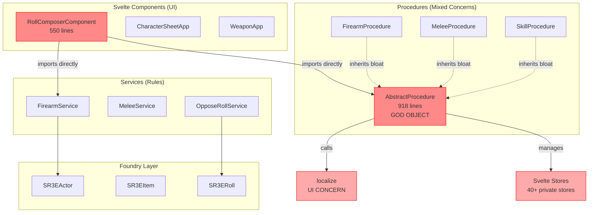
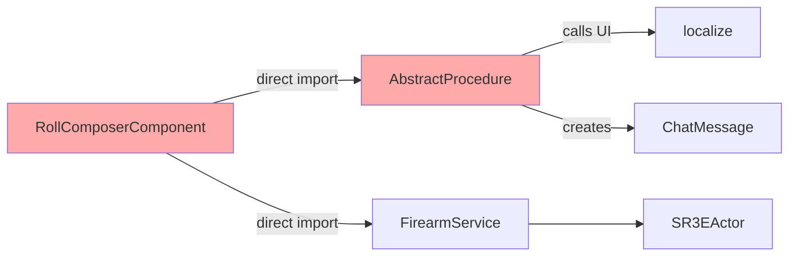

# Current Architecture Analysis

**Status**: Legacy (JS/TS mixed, 15% migrated)
**Architecture Score**: 5.5/10
**Decision**: Rewrite with layered architecture

## Current Structure



## Critical Issues

### 1. AbstractProcedure God Object (918 lines)

**Responsibilities** (should be separate):
- ❌ State management (40+ private store fields)
- ❌ UI bindings (Svelte store subscriptions)
- ❌ Serialization (toJSON, fromJSON)
- ❌ Combat logic (modifiers, targeting, recoil)
- ❌ Locking behavior (ProcedureLock integration)
- ❌ Localization (calls `localize()` directly)

**Impact**:
- Untestable without mocking Svelte
- Subclasses inherit all complexity
- Cannot refactor without cascading changes

### 2. Mixed Reactivity Patterns

```svelte
<!-- RollComposerComponent.svelte -->
<script>
  let procedureStore = writable(null);  // Legacy store
  let targetNumber = $state(4);         // Svelte 5 rune
  let modifiersTotal = $state(0);       // Svelte 5 rune

  // Later: mixing both systems
  const existing = $procedureStore;
  existing.args = ...;
</script>
```

**Problem**: Two reactivity systems = unpredictable updates

### 3. Type Safety Theater

```typescript
// Current "TypeScript"
Record<string, any>  // ← Everywhere
type ProcedureArgs = any;  // ← No safety

// StoreManager.svelte.ts
GetSumROStore(key: string): any {  // ← Returns any
  return this.#stores[key];
}
```

**Impact**: TypeScript syntax without TypeScript benefits

### 4. Coupling: UI ↔ Rules ↔ Foundry



**No clear boundaries** - changes ripple everywhere

## File Hotspots

| File | Lines | Issue | Fix Effort |
|------|-------|-------|------------|
| `AbstractProcedure.js` | 918 | God object | 2-3 days |
| `RollComposerComponent.svelte` | 550 | Monolithic | 1-2 days |
| `config.ts` | 704 | String mapping | 4 hours |
| `NewsService.svelte.js` | 534 | Over-engineered | 4 hours |

## What Works

✅ **Service layer** (FirearmService, MeleeService) - clean rules logic
✅ **StoreManager** - well-designed abstraction with reference counting
✅ **Foundry integration** - correct use of v13 APIs
✅ **Data models** - schema structure is sound

## Decision Rationale

**Why rewrite instead of refactor:**

1. Cannot achieve layered architecture without rewriting core (AbstractProcedure is the foundation)
2. Type safety requires designing types upfront, not retrofitting onto `any`
3. Procedures + UI + Foundry are too coupled to untangle incrementally
4. Have reference implementation on branch - can copy algorithms without starting from zero

**Next**: See [[Proposed Architecture]]
