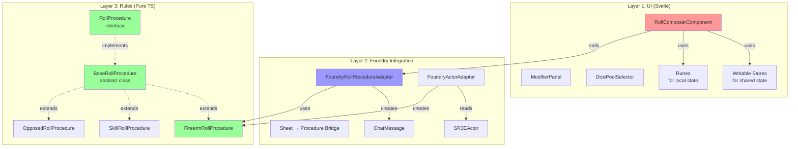
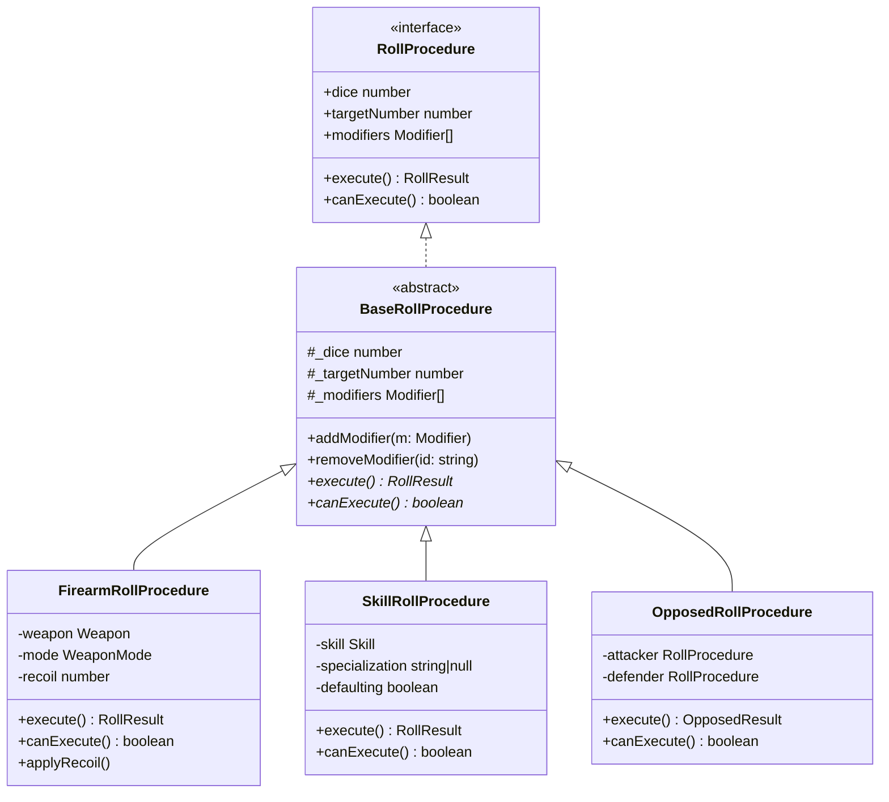
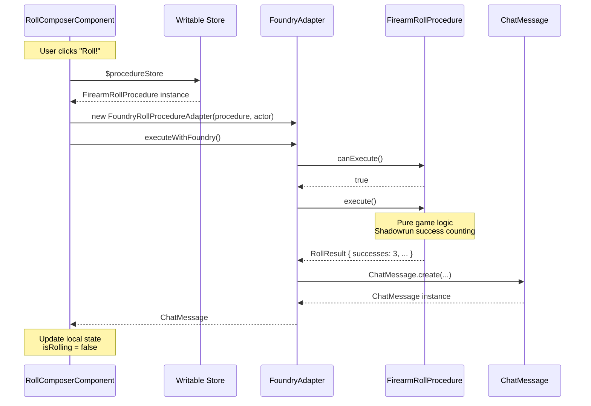

# Proposed Layered Architecture

**Goal**: Clean separation of UI, Rules, and Foundry concerns with strong types

## Three-Layer Design



## Layer Responsibilities

### Layer 1: UI (Svelte Components)

**Concerns**:
- User interaction
- Visual state (loading, disabled, etc.)
- Localization
- Layout and styling

**NOT allowed to**:
- ❌ Calculate game rules
- ❌ Know about Foundry APIs
- ❌ Import from `@rules` directly

**Communication**:
- Receives procedures via `Writable<RollProcedure | null>`
- Calls adapters to execute procedures
- Uses runes for local UI state

```svelte
<script lang="ts">
  import type { Writable } from 'svelte/store';
  import type { RollProcedure } from '@rules/rolls/RollProcedure';

  interface Props {
    procedureStore: Writable<RollProcedure | null>;
  }

  let { procedureStore }: Props = $props();

  // Local UI state (runes)
  let isRolling = $state(false);

  // Shared state (writables)
  $: procedure = $procedureStore;
</script>
```

### Layer 2: Foundry Integration (Adapters)

**Concerns**:
- Creating procedures from Foundry documents
- Executing procedures and creating chat messages
- Bridging between Foundry data and rules types
- Managing Foundry-specific state (combat, targeting)

**NOT allowed to**:
- ❌ Contain game logic (that's rules layer)
- ❌ Render UI (that's Svelte layer)

**Communication**:
- Converts `SR3EActor` → procedure constructor params
- Calls `procedure.execute()` and wraps result in `ChatMessage`
- Provides typed interfaces for UI layer to use

```typescript
export class FoundryRollProcedureAdapter {
  constructor(
    private procedure: RollProcedure,
    private actor: SR3EActor
  ) {}

  async executeWithFoundry(): Promise<ChatMessage> {
    const result = this.procedure.execute();

    // Only this layer knows about ChatMessage
    return ChatMessage.create({
      speaker: ChatMessage.getSpeaker({ actor: this.actor }),
      content: await this.renderRollCard(result),
      rolls: [result.roll]
    });
  }
}
```

### Layer 3: Rules (Pure TypeScript)

**Concerns**:
- Game logic (Shadowrun rules)
- Calculations (success counting, modifiers, damage)
- Validation (can this action be performed?)
- Pure data transformations

**NOT allowed to**:
- ❌ Import Svelte or Foundry
- ❌ Call `localize()` (return message keys instead)
- ❌ Create side effects (chat messages, document updates)

**Communication**:
- Exposes interfaces for adapters to implement
- Returns results as pure data (no side effects)
- Testable in complete isolation

```typescript
export interface RollProcedure {
  readonly dice: number;
  readonly targetNumber: number;
  readonly modifiers: Modifier[];

  execute(): RollResult;
  canExecute(): boolean;
}

export abstract class BaseRollProcedure implements RollProcedure {
  // Pure logic, no framework dependencies
}
```

## Reactivity Strategy

### Writables: Inter-Component Communication

```typescript
// StoreManager creates and manages writables
const procedureStore: Writable<RollProcedure | null> = writable(null);

// Multiple components can subscribe
// Component A
$: procedure = $procedureStore;

// Component B
$: canRoll = $procedureStore?.canExecute() ?? false;
```

**Use for**:
- Shared state across components
- Actor/item data subscriptions
- Procedure instances
- Global UI state (dialog visibility, etc.)

### Runes: Local Component State

```svelte
<script>
  let isRolling = $state(false);        // Local to this component
  let diceCount = $state(6);            // Local to this component
  let expanded = $state(false);         // Local to this component

  let finalDice = $derived(diceCount + poolBonus);  // Computed from local state
</script>
```

**Use for**:
- UI-only state (loading, expanded, focused)
- Local counters and inputs
- Derived values from local state

### Clear Boundary

```svelte
<script>
  // GOOD: Clear separation
  let procedureStore: Writable<RollProcedure | null>;  // Shared (writable)
  let isRolling = $state(false);                       // Local (rune)

  // BAD: Mixing patterns
  let procedureStore = writable(null);                 // ← Should be typed writable
  let targetNumber = $state(4);                        // ← Should be in procedure
  $procedureStore.targetNumber = targetNumber;         // ← Mixing both systems
</script>
```

## Type Safety

### Strong Interfaces

```typescript
// NO MORE THIS
type ProcedureArgs = Record<string, any>;

// INSTEAD
interface RollResult {
  readonly successes: number;
  readonly glitches: number;
  readonly roll: Roll;
  readonly messageKey: string;  // For localization
}

interface Modifier {
  readonly id: string;
  readonly name: string;
  readonly value: number;
  readonly source?: string;
}

interface RollProcedure {
  readonly dice: number;
  readonly targetNumber: number;
  readonly modifiers: Modifier[];

  execute(): RollResult;
  canExecute(): boolean;
}
```

### Polymorphism via Inheritance



## Example: Complete Roll Flow



## Benefits

✅ **Testable**: Rules layer has no dependencies, pure unit tests
✅ **Type-safe**: Strong interfaces, no `any`
✅ **Maintainable**: Clear boundaries, change one layer without affecting others
✅ **Scalable**: Add new procedure types by extending base
✅ **Debuggable**: Clear data flow, no mystery state

## Migration from Current

See [[Rewrite Plan]] for implementation roadmap.
