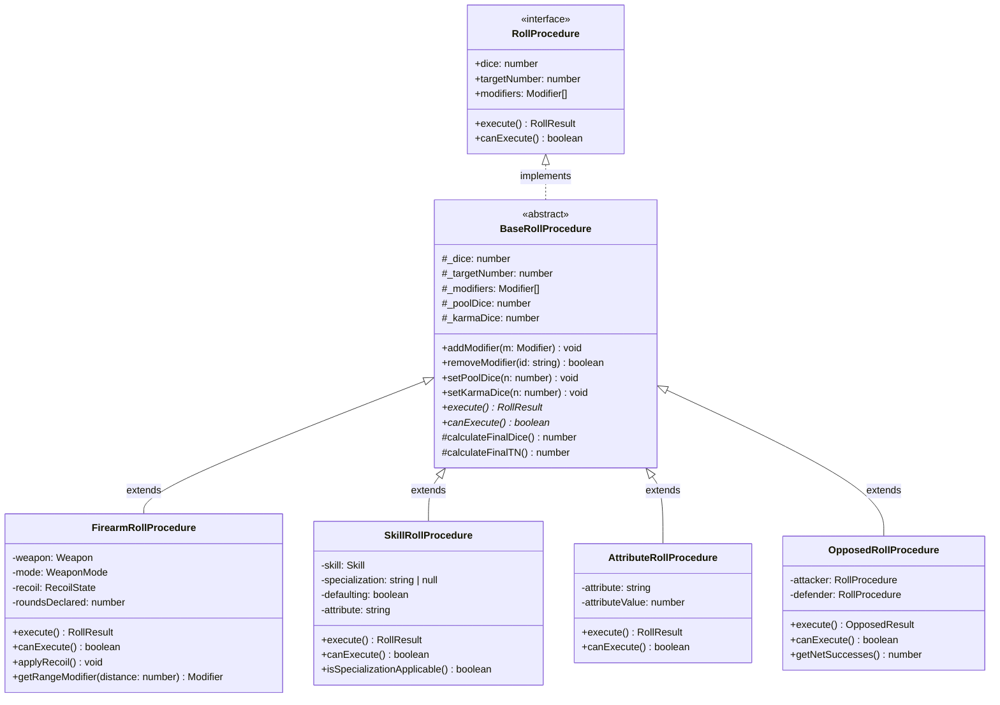

# RollProcedure System Design

Core rules engine for SR3E system.

## Class Hierarchy



## Core Types

### Modifier

```typescript
interface Modifier {
  readonly id: string;
  readonly name: string;
  readonly value: number;
  readonly source?: string;
  readonly locked?: boolean;  // Cannot be removed by UI
}
```

**Examples**:
- `{ id: "range", name: "Range", value: 2, source: "combat" }`
- `{ id: "wound", name: "Wound", value: 1, source: "damage", locked: true }`
- `{ id: "custom", name: "Visibility", value: 3 }`

### RollResult

```typescript
interface RollResult {
  readonly successes: number;
  readonly glitches: number;
  readonly ones: number;
  readonly roll: Roll;  // Foundry Roll instance
  readonly messageKey: string;  // For localization
  readonly metadata?: Record<string, unknown>;
}
```

### OpposedResult

```typescript
interface OpposedResult extends RollResult {
  readonly attackerSuccesses: number;
  readonly defenderSuccesses: number;
  readonly netSuccesses: number;
  readonly attackerWins: boolean;
}
```

## BaseRollProcedure Implementation

```typescript
export abstract class BaseRollProcedure implements RollProcedure {
  protected _dice: number;
  protected _targetNumber: number;
  protected _modifiers: Modifier[] = [];
  protected _poolDice: number = 0;
  protected _karmaDice: number = 0;

  constructor(dice: number, targetNumber: number) {
    this._dice = dice;
    this._targetNumber = targetNumber;
  }

  get dice(): number {
    return this.calculateFinalDice();
  }

  get targetNumber(): number {
    return this.calculateFinalTN();
  }

  get modifiers(): Modifier[] {
    return [...this._modifiers];  // Return copy
  }

  addModifier(modifier: Modifier): void {
    const existing = this._modifiers.findIndex(m => m.id === modifier.id);
    if (existing >= 0) {
      this._modifiers[existing] = modifier;
    } else {
      this._modifiers.push(modifier);
    }
  }

  removeModifier(id: string): boolean {
    const index = this._modifiers.findIndex(m => m.id === id);
    if (index >= 0 && !this._modifiers[index].locked) {
      this._modifiers.splice(index, 1);
      return true;
    }
    return false;
  }

  setPoolDice(n: number): void {
    this._poolDice = Math.max(0, Math.floor(n));
  }

  setKarmaDice(n: number): void {
    this._karmaDice = Math.max(0, Math.floor(n));
  }

  protected calculateFinalDice(): number {
    return this._dice + this._poolDice + this._karmaDice;
  }

  protected calculateFinalTN(): number {
    const modTotal = this._modifiers.reduce((sum, m) => sum + m.value, 0);
    return Math.max(2, this._targetNumber + modTotal);
  }

  abstract execute(): RollResult;
  abstract canExecute(): boolean;
}
```

## Concrete Implementation: FirearmRollProcedure

```typescript
export class FirearmRollProcedure extends BaseRollProcedure {
  private weapon: Weapon;
  private mode: WeaponMode;
  private recoil: RecoilState;
  private roundsDeclared: number;

  constructor(
    dice: number,
    targetNumber: number,
    weapon: Weapon,
    mode: WeaponMode,
    recoil: RecoilState,
    roundsDeclared: number = 1
  ) {
    super(dice, targetNumber);
    this.weapon = weapon;
    this.mode = mode;
    this.recoil = recoil;
    this.roundsDeclared = roundsDeclared;

    // Auto-apply recoil modifier
    this.applyRecoil();
  }

  execute(): RollResult {
    if (!this.canExecute()) {
      throw new Error("Cannot execute: insufficient ammo");
    }

    const finalDice = this.calculateFinalDice();
    const finalTN = this.calculateFinalTN();

    // Shadowrun 3E success counting
    const roll = new Roll(`${finalDice}d6`);
    roll.evaluate({ async: false });

    const successes = roll.dice[0].results.filter(r => r.result >= finalTN).length;
    const ones = roll.dice[0].results.filter(r => r.result === 1).length;
    const glitches = ones > Math.floor(finalDice / 2) ? 1 : 0;

    return {
      successes,
      glitches,
      ones,
      roll,
      messageKey: this.getMessageKey(successes, glitches),
      metadata: {
        weapon: this.weapon.name,
        mode: this.mode,
        rounds: this.roundsDeclared
      }
    };
  }

  canExecute(): boolean {
    const required = this.mode === 'fullauto' ? this.roundsDeclared :
                     this.mode === 'burst' ? 3 : 1;
    return this.weapon.currentAmmo >= required;
  }

  applyRecoil(): void {
    if (this.recoil.value > 0) {
      this.addModifier({
        id: 'recoil',
        name: 'Recoil',
        value: this.recoil.value,
        source: 'combat',
        locked: true
      });
    }
  }

  getRangeModifier(distance: number): Modifier {
    const ranges = this.weapon.ranges;
    let value = 0;

    if (distance <= ranges.short) value = 0;
    else if (distance <= ranges.medium) value = 2;
    else if (distance <= ranges.long) value = 4;
    else if (distance <= ranges.extreme) value = 6;
    else value = 999;  // Out of range

    return {
      id: 'range',
      name: 'Range',
      value,
      source: 'combat'
    };
  }

  private getMessageKey(successes: number, glitches: number): string {
    if (glitches > 0 && successes === 0) return 'sr3e.roll.criticalGlitch';
    if (glitches > 0) return 'sr3e.roll.glitch';
    if (successes === 0) return 'sr3e.roll.failure';
    return 'sr3e.roll.success';
  }
}
```

## Usage in Foundry Layer

```typescript
// FoundryActorAdapter.ts
export class FoundryActorAdapter {
  static createFirearmProcedure(
    actor: SR3EActor,
    weapon: SR3EItem,
    mode: WeaponMode
  ): FirearmRollProcedure {
    // Extract data from Foundry documents
    const skill = actor.items.get(weapon.system.associatedSkill);
    const dice = skill?.system.rating ?? 0;
    const targetNumber = weapon.system.targetNumber ?? 4;
    const recoil = RecoilService.getRecoilForActor(actor.id);

    // Create pure procedure
    const procedure = new FirearmRollProcedure(
      dice,
      targetNumber,
      weapon,
      mode,
      recoil
    );

    // Apply automatic modifiers (wounds, etc.)
    const woundMod = actor.system.health.woundModifier;
    if (woundMod > 0) {
      procedure.addModifier({
        id: 'wound',
        name: 'Wound',
        value: woundMod,
        source: 'damage',
        locked: true
      });
    }

    return procedure;
  }
}
```

## Usage in UI Layer

```svelte
<script lang="ts">
  import type { Writable } from 'svelte/store';
  import type { RollProcedure } from '@rules/rolls/RollProcedure';
  import { FoundryRollProcedureAdapter } from '@foundry/adapters';

  interface Props {
    procedureStore: Writable<RollProcedure | null>;
    actor: SR3EActor;
  }

  let { procedureStore, actor }: Props = $props();

  let isRolling = $state(false);
  let poolDice = $state(0);
  let karmaDice = $state(0);

  async function handleRoll() {
    const proc = $procedureStore;
    if (!proc) return;

    isRolling = true;

    // Set ephemeral state
    proc.setPoolDice(poolDice);
    proc.setKarmaDice(karmaDice);

    // Execute via adapter
    const adapter = new FoundryRollProcedureAdapter(proc, actor);
    await adapter.executeWithFoundry();

    isRolling = false;
    poolDice = 0;
    karmaDice = 0;
  }
</script>

<div>
  <h1>{$procedureStore?.dice ?? 0} dice vs TN {$procedureStore?.targetNumber ?? 4}</h1>

  <Counter bind:value={poolDice} min={0} max={10} />
  <Counter bind:value={karmaDice} min={0} max={5} />

  <button
    disabled={isRolling || !$procedureStore?.canExecute()}
    onclick={handleRoll}
  >
    Roll!
  </button>
</div>
```

## Testing

```typescript
// FirearmRollProcedure.test.ts
describe('FirearmRollProcedure', () => {
  it('calculates recoil modifier correctly', () => {
    const weapon = new Weapon({ name: 'Ares Predator', currentAmmo: 15 });
    const recoil = { value: 2, shots: 4 };

    const proc = new FirearmRollProcedure(
      6,  // dice
      4,  // base TN
      weapon,
      'semi-auto',
      recoil
    );

    expect(proc.targetNumber).toBe(6);  // 4 + 2 (recoil)
    expect(proc.modifiers.find(m => m.id === 'recoil')).toBeDefined();
  });

  it('prevents execution when out of ammo', () => {
    const weapon = new Weapon({ name: 'Empty Gun', currentAmmo: 0 });
    const proc = new FirearmRollProcedure(6, 4, weapon, 'semi-auto', { value: 0 });

    expect(proc.canExecute()).toBe(false);
    expect(() => proc.execute()).toThrow();
  });
});
```

No Foundry, no Svelte, pure unit tests.

## Next Steps

See [[Rewrite Plan]] for implementation roadmap.
